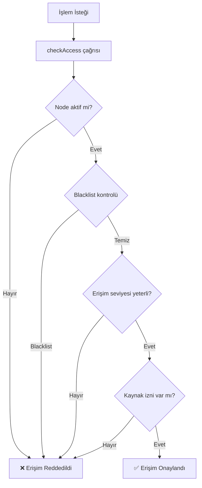

# PDM Sistemi - Düğüm, Rol ve Erişim İzinleri Tablosu

Bu doküman, PDM sistemindeki düğüm tiplerini, rollerini ve erişim izinlerini detaylı olarak açıklar.

---

## 📊 **Ana Tablo: Düğüm Tipleri, Roller ve İzinler**

| **Düğüm Tipi** | **Enum Değeri** | **Kullanıcı Rolü** | **Otomatik Blockchain Rolü** | **Otomatik Kaynak İzinleri** | **Erişim Seviyesi** | **Ana Görevleri** |
|----------------|-----------------|-------------------|------------------------------|-------------------------------|---------------------|-------------------|
| **DATA_PROCESSOR** | `1` | 👷 **Operator** | `OPERATOR_ROLE` | `SENSOR_DATA` (Write) | `WRITE_LIMITED` | • Sensör verisi toplama<br/>• ZK proof oluşturma<br/>• Blockchain'e veri gönderme |
| **FAILURE_ANALYZER** | `2` | 👨‍🔧 **Engineer** | `ENGINEER_ROLE` | `PREDICTION` (Write)<br/>`SENSOR_DATA` (Read) | `WRITE_LIMITED` | • ML model eğitimi<br/>• Tahmin analizi<br/>• Prediction proof oluşturma |
| **MANAGER** | `3` | 👨‍💼 **Manager** | `SYSTEM_ADMIN_ROLE` 👑 | `SENSOR_DATA` (Full)<br/>`PREDICTION` (Full)<br/>`CONFIG` (Full)<br/>`AUDIT_LOGS` (Full) | `ADMIN_ACCESS` | • Sistem yönetimi<br/>• Node kayıt/güncelleme<br/>• Erişim kontrolü<br/>• Audit log yönetimi |
| **UNDEFINED** | `0` | ❓ **Belirsiz** | - | Yok | `NO_ACCESS` | • Manuel konfigürasyon gerekli<br/>• Varsayılan durum |

---

## 🔐 **Rol Bazlı Yetkilendirme**

### **Blockchain Rolleri (Smart Contract)**

| **Rol** | **Keccak256 Hash** | **Yetki Seviyesi** | **Sahip Olan Düğümler** | **Ana İşlevler** |
|---------|-------------------|-------------------|------------------------|------------------|
| `SUPER_ADMIN_ROLE` | `keccak256("SUPER_ADMIN_ROLE")` | 🔴 **En Yüksek** | Sadece contract owner | • Tüm rolleri yönetme<br/>• Acil durum müdahalesi<br/>• Sistem ayarları |
| `SYSTEM_ADMIN_ROLE` | `keccak256("SYSTEM_ADMIN_ROLE")` | 🟠 **Yüksek** | MANAGER düğümleri | • Node yönetimi<br/>• Erişim onaylama<br/>• Blacklist işlemleri |
| `ENGINEER_ROLE` | `keccak256("ENGINEER_ROLE")` | 🟡 **Orta** | FAILURE_ANALYZER düğümleri | • Tahmin işlemleri<br/>• Model yönetimi<br/>• Sensor data okuma |
| `OPERATOR_ROLE` | `keccak256("OPERATOR_ROLE")` | 🟢 **Düşük** | DATA_PROCESSOR düğümleri | • Sensor data gönderme<br/>• ZK proof oluşturma |

---

## 📋 **Kaynak Bazlı Erişim Kontrolü**

### **Kaynak Tanımları**

| **Kaynak** | **Keccak256 Hash** | **Açıklama** | **Erişim Türü** |
|------------|-------------------|--------------|-----------------|
| `SENSOR_DATA_RESOURCE` | `keccak256("SENSOR_DATA")` | Sensör verileri (sıcaklık, tork, vb.) | Read/Write |
| `PREDICTION_RESOURCE` | `keccak256("PREDICTION")` | ML tahmin sonuçları | Read/Write |
| `MAINTENANCE_RESOURCE` | `keccak256("MAINTENANCE")` | Bakım planları ve kayıtları | Read/Write |
| `CONFIG_RESOURCE` | `keccak256("CONFIG")` | Sistem konfigürasyonu | Read/Write |
| `AUDIT_LOGS_RESOURCE` | `keccak256("AUDIT_LOGS")` | Audit logları ve geçmiş | Read |

### **Kaynak Erişim Matrisi**

| **Düğüm Tipi** | **SENSOR_DATA** | **PREDICTION** | **MAINTENANCE** | **CONFIG** | **AUDIT_LOGS** |
|----------------|-----------------|----------------|-----------------|------------|----------------|
| **DATA_PROCESSOR** | ✅ Write | ❌ No | ❌ No | ❌ No | ❌ No |
| **FAILURE_ANALYZER** | ✅ Read | ✅ Write | ❌ No | ❌ No | ❌ No |
| **MANAGER** | ✅ Full | ✅ Full | ✅ Full | ✅ Full | ✅ Read |
| **UNDEFINED** | ❌ No | ❌ No | ❌ No | ❌ No | ❌ No |

---

## 🎯 **Erişim Seviyeleri**

| **Seviye** | **Enum Değeri** | **Açıklama** | **Kullanım Alanları** |
|------------|-----------------|--------------|----------------------|
| `NO_ACCESS` | `0` | Erişim yok | Blacklist durumu, henüz onaylanmamış |
| `READ_ONLY` | `1` | Sadece okuma | Audit, monitoring, raporlama |
| `WRITE_LIMITED` | `2` | Sınırlı yazma | Normal operasyonel işlemler |
| `FULL_ACCESS` | `3` | Tam erişim | Yönetim işlemleri |
| `ADMIN_ACCESS` | `4` | Yönetici erişimi | Sistem yönetimi, kritik işlemler |

---

## 🔄 **Otomatik İzin Verme Sistemi**

### **Nasıl Çalışır?**

Node kaydı sırasında (`registerNode` fonksiyonu) düğüm tipi algılanır ve **otomatik olarak** gerekli izinler verilir:

```solidity
function registerNode(..., NodeType nodeType, ...) {
    // Node oluştur
    nodes[nodeId] = Node({...});
    
    // 🚀 Otomatik izin ver
    _autoGrantPermissionsByNodeType(nodeId, nodeType);
}
```

### **Otomatik İzin Detayları**

| **Düğüm Tipi** | **Otomatik Kaynak İzinleri** | **Otomatik Blockchain Rolü** | **Manuel İşlem Gerekli mi?** |
|----------------|------------------------------|------------------------------|------------------------------|
| **DATA_PROCESSOR** | `SENSOR_DATA` → `true` | `OPERATOR_ROLE` atanır | ❌ Hayır - Hemen çalışır |
| **FAILURE_ANALYZER** | `PREDICTION` → `true`<br/>`SENSOR_DATA` → `true` | `ENGINEER_ROLE` atanır | ❌ Hayır - Hemen çalışır |
| **MANAGER** | Tüm kaynaklar → `true` | `SYSTEM_ADMIN_ROLE` atanır | ❌ Hayır - Hemen çalışır |
| **UNDEFINED** | Hiçbir izin verilmez | Hiçbir rol atanmaz | ✅ Evet - Manuel konfigürasyon gerekli |

---

## 🏗️ **Pratik Kullanım Senaryoları**

### **Senaryo 1: Fabrika Operatörü Kaydı**

```javascript
// 1️⃣ Manager, yeni operatör kaydı yapar
await accessRegistry.registerNode(
    "Factory-Operator-1",     // nodeName
    operatorWallet,           // nodeAddress
    1,                        // NodeType.DATA_PROCESSOR
    2,                        // AccessLevel.WRITE_LIMITED
    0,                        // accessDuration (süresiz)
    '{"location":"line1"}'    // metadata
);

// ✅ OTOMATIK OLARAK:
// - operatorWallet → OPERATOR_ROLE ✅
// - SENSOR_DATA kaynağına yazma izni ✅
// - Hemen sensor data gönderebilir! 🚀
```

### **Senaryo 2: ML Engineer Kaydı**

```javascript
// 1️⃣ Manager, yeni engineer kaydı yapar
await accessRegistry.registerNode(
    "ML-Engineer-1",          // nodeName
    engineerWallet,           // nodeAddress
    2,                        // NodeType.FAILURE_ANALYZER
    2,                        // AccessLevel.WRITE_LIMITED
    0,                        // accessDuration (süresiz)
    '{"department":"ai"}'     // metadata
);

// ✅ OTOMATIK OLARAK:
// - engineerWallet → ENGINEER_ROLE ✅
// - PREDICTION kaynağına yazma izni ✅
// - SENSOR_DATA kaynağına okuma izni ✅
// - Hemen prediction gönderebilir! 🚀
```

### **Senaryo 3: Sistem Yöneticisi Kaydı**

```javascript
// 1️⃣ SUPER_ADMIN, yeni manager kaydı yapar
await accessRegistry.registerNode(
    "System-Manager-1",       // nodeName
    managerWallet,            // nodeAddress
    3,                        // NodeType.MANAGER
    4,                        // AccessLevel.ADMIN_ACCESS
    0,                        // accessDuration (süresiz)
    '{"level":"senior"}'      // metadata
);

// ✅ OTOMATIK OLARAK:
// - managerWallet → SYSTEM_ADMIN_ROLE ✅
// - TÜM kaynaklara tam erişim ✅
// - Node yönetimi yapabilir! 👑
```

---

## 🚫 **Erişim Kontrolü ve Güvenlik**

### **Erişim Kontrol Akışı**



### **Güvenlik Katmanları**

| **Katman** | **Kontrol** | **Amaç** |
|------------|-------------|----------|
| **1. Düğüm Durumu** | `NodeStatus.ACTIVE` | Sadece aktif düğümler işlem yapabilir |
| **2. Blacklist** | `isBlacklisted == false` | Güvenlik ihlali olan düğümleri engelle |
| **3. Erişim Süresi** | `accessExpiresAt > now` | Zaman sınırlı erişim kontrolü |
| **4. Erişim Seviyesi** | `accessLevel >= required` | Yetki seviyesi kontrolü |
| **5. Kaynak İzni** | `nodePermissions[node][resource]` | Kaynak bazlı izin kontrolü |
| **6. Blockchain Rolü** | `hasRole[address][role]` | Rol bazlı yetkilendirme |

---

## 📈 **Avantajlar ve Faydalar**

### **✅ Otomatik İzin Verme Sistemi**

1. **🚀 Hızlı Kurulum**: Node kaydı = Hemen çalışır durum
2. **🔒 Güvenli**: Her düğüm tipi doğru izinleri alır
3. **💰 Gas Tasarrufu**: 2 transaction yerine 1 transaction
4. **👥 Kullanıcı Dostu**: Karmaşık manuel süreç yok
5. **🎯 Tutarlı**: Standart izinler, hata riski az

### **✅ Hiyerarşik Rol Sistemi**

1. **📊 Net Sorumluluklar**: Her rolün görevi açık
2. **🔐 En Az Ayrıcalık**: Sadece gerekli izinler
3. **🔄 Esnek Yönetim**: Roller değiştirilebilir
4. **📝 Audit Trail**: Tüm işlemler kayıtlı
5. **⚡ Hızlı Kontrol**: O(1) erişim kontrolü

---

## 🔧 **Yönetim Komutları**

### **Node Yönetimi**

```solidity
// Node kaydet
registerNode(name, address, nodeType, accessLevel, duration, metadata)

// Node güncelle
updateNode(nodeId, name, nodeType, accessLevel, metadata)

// Node durumu değiştir
changeNodeStatus(nodeId, newStatus)

// Node sil
removeNode(nodeId, reason)
```

### **Rol Yönetimi**

```solidity
// Rol oluştur (sadece SUPER_ADMIN)
createRole(roleHash)

// Rol ver (sadece SUPER_ADMIN)
grantRole(roleHash, account)

// Rol iptal et (sadece SUPER_ADMIN)
revokeRole(roleHash, account)
```

### **Erişim Yönetimi**

```solidity
// Erişim isteği oluştur
requestAccess(nodeId, resource, level, duration, justification)

// Erişim isteğini onayla (sadece SYSTEM_ADMIN)
approveAccessRequest(requestId)

// Erişim isteğini reddet (sadece SYSTEM_ADMIN)
denyAccessRequest(requestId, reason)

// Erişim iptal et (sadece SYSTEM_ADMIN)
revokeAccess(nodeId, resource)
```

---

## 📊 **Özet**

PDM sistemi, **3 ana düğüm tipi** ve **4 blockchain rolü** ile çalışır:

- **👷 DATA_PROCESSOR** → Sensör verisi toplama
- **👨‍🔧 FAILURE_ANALYZER** → ML tahmin analizi  
- **👨‍💼 MANAGER** → Sistem yönetimi

Her düğüm tipi kayıt anında **otomatik olarak** gerekli izinleri alır ve hemen çalışmaya başlar. Bu sistem sayesinde:

✅ **Hızlı kurulum** - 1 adımda çalışır durum  
✅ **Güvenli erişim** - Çok katmanlı kontrol  
✅ **Esnek yönetim** - Roller değiştirilebilir  
✅ **Audit trail** - Tüm işlemler kayıtlı  
✅ **Gas tasarrufu** - Otomatik izin verme  

Bu yapı, hem akademik demo hem de production ortamı için ideal bir erişim kontrol sistemi sağlar! 🚀
