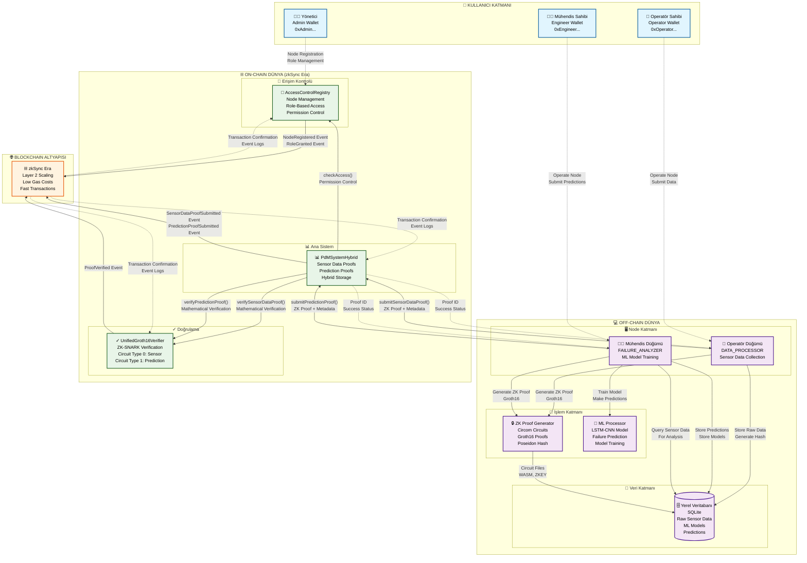

# PDM Sistemi - Sistem Mimarisi Diagramı

Bu doküman, PDM sisteminin tüm bileşenlerini ve aralarındaki ana etkileşimleri gösteren üst seviye sistem mimarisi diagramını içerir.

---

## 🏗️ **Sistem Mimarisi Genel Bakış**

---
