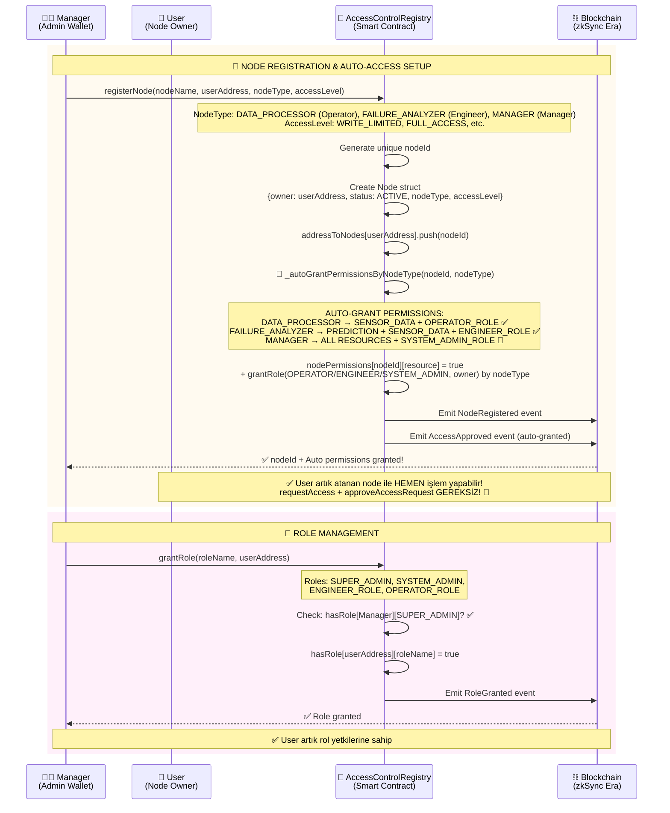
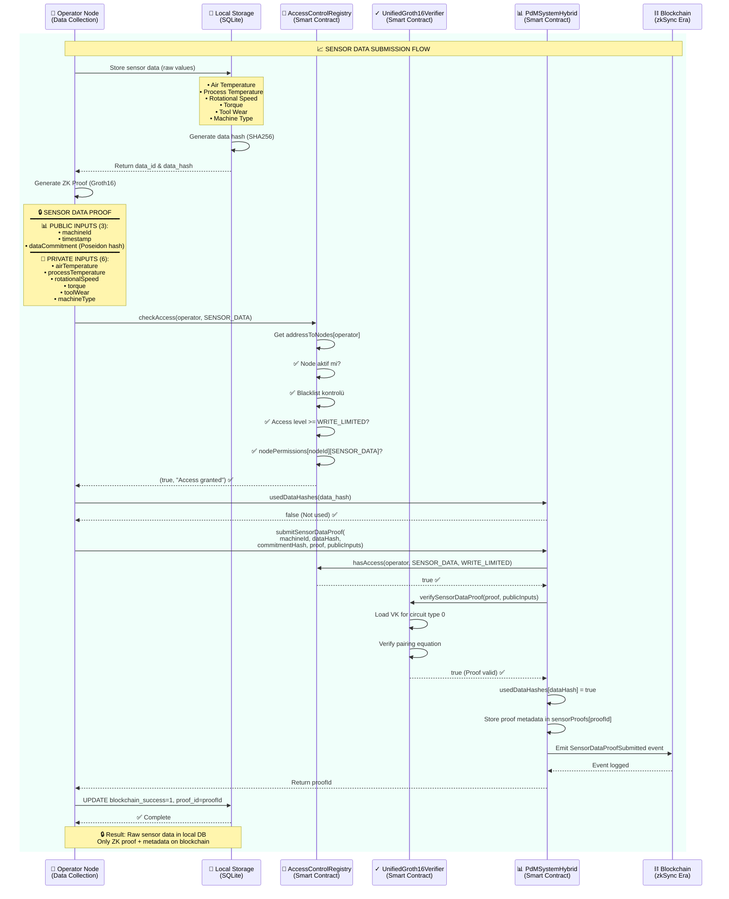
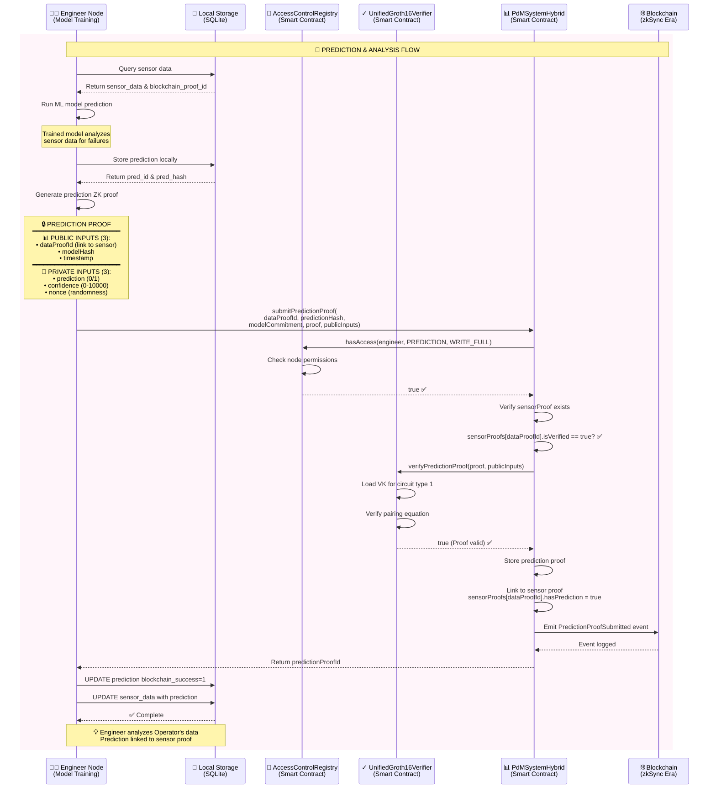

# PDM System - Sequence Diagrams

Bu dosya, PDM sisteminin farklı süreçlerini gösteren modüler sequence diyagramlarını içerir.

---

## 📋 İçindekiler

1. [Node Management & Access Control](#1-node-management--access-control) - Node kayıt, erişim izinleri, rol atama
2. [Sensor Data Submission](#2-sensor-data-submission) - Sensör verisi gönderme
3. [Prediction Submission](#3-prediction-submission) - Tahmin analizi

---

## 1. Node Management & Access Control

Node kaydı, erişim izinleri ve rol atama işlemleri.



---

## 2. Sensor Data Submission

Operatör tarafından sensör verisi toplama ve blockchain'e gönderme.



---

## 3. Prediction Submission

Engineer tarafından ML model ile tahmin yapma ve blockchain'e gönderme.



---

## 📊 Diagram Özeti

| Diagram | Amaç | Ana Aktörler | Temel İşlemler |
|---------|------|--------------|----------------|
| **1. Node Management & Access Control** | Node kayıt, güncelleme, rol atama, erişim yönetimi | Manager, Operator, Engineer | Node kayıt/güncelleme, izin verme/iptal, blacklist, rol atama |
| **2. Sensor Data Submission** | Sensör verisi toplama ve blockchain'e gönderme | Operator | Veri toplama, ZK proof oluşturma, blockchain gönderimi |
| **3. Prediction Submission** | Tahmin analizi ve blockchain'e gönderme | Engineer | Model çalıştırma, prediction proof, sensor proof linking |

---

## 🔗 Proof Zinciri

```
Sensor Proof (Operator)
    ↓ (linked by dataProofId)
Prediction Proof (Engineer)
```

Her proof bir öncekine bağlıdır ve blockchain'de doğrulanabilir bir zincir oluşturur.

---

## 🏗️ Mimari Bileşenler

1. **Local Storage (SQLite)**
   - Ham sensör verilerini saklar
   - Makine öğrenmesi modellerini saklar
   - Tahmin sonuçlarını saklar

2. **AccessControlRegistry (Smart Contract)**
   - Node kayıt yönetimi (Operator, Engineer)
   - Rol bazlı erişim kontrolü
   - Yetki seviyesi yönetimi (WRITE_FULL / WRITE_LIMITED)

3. **UnifiedGroth16Verifier (Smart Contract)**
   - ZK-SNARK proof doğrulama
   - Verification Key (VK) yönetimi
   - Farklı circuit tipleri için pairing kontrolü

4. **PdMSystemHybrid (Smart Contract)**
   - Sensör data proof'larını saklar
   - Tahmin proof'larını saklar
   - Proof'lar arası ilişkileri yönetir

5. **Blockchain (zkSync Era)**
   - Layer 2 ölçeklenebilirlik
   - Düşük gas maliyetleri
   - Hızlı işlem onayları

---

## 👥 Rol Bazlı Erişim Kontrolü

### **1. 👨‍💼 Manager Node (Yönetici)**
- **Sorumluluk:** Sistem kurulumu, node yönetimi, erişim kontrolü
- **Yetki Seviyesi:** `SYSTEM_ADMIN_ROLE` / `ADMIN_ACCESS`
- **İşlemler:**
  - ✅ Node kayıt (Operator, Engineer)
  - ✅ Erişim izni verme/kaldırma
  - ✅ Access request onaylama
  - ✅ Sistem konfigürasyonu
- **AccessControl:** `SYSTEM_ADMIN_ROLE`

### **2. 👨‍🔧 Engineer Node (Mühendis)**
- **Sorumluluk:** Model eğitimi, tahmin analizi
- **Yetki Seviyesi:** `ENGINEER_ROLE` / `WRITE_LIMITED`
- **İşlemler:**
  - ✅ Model konfigürasyonu güncelleme
  - ✅ Eğitilmiş model kaydetme
  - ✅ Tahmin (prediction) proof'u gönderme
  - ✅ Sensor data sorgulama
- **AccessControl:** `hasRole[engineer][ENGINEER_ROLE]` + `hasAccess(engineer, PREDICTION/SENSOR_DATA, WRITE_LIMITED)`

### **3. 👷 Operator Node (Operatör)**
- **Sorumluluk:** Sensör veri toplama, makine izleme
- **Yetki Seviyesi:** `OPERATOR_ROLE` / `WRITE_LIMITED`
- **İşlemler:**
  - ✅ Sensör verisi toplama ve gönderme
  - ✅ ZK proof oluşturma
  - ❌ Model güncelleme (yetkisiz)
  - ❌ Config değiştirme (yetkisiz)
- **AccessControl:** `hasRole[operator][OPERATOR_ROLE]` + `hasAccess(operator, SENSOR_DATA, WRITE_LIMITED)`

---

## 🔒 Gizlilik Modeli

- **Off-chain:** Ham sensör değerleri (6 parametre)
- **On-chain:** Sadece ZK proof + metadata (machineId, timestamp, dataCommitment)
- **Sonuç:** Tam veri gizliliği + blockchain doğrulaması

---

## 🗂️ Node Tipleri

Sistem **3 aktif node tipi** kullanır:

### **1. DATA_PROCESSOR (NodeType = 1)**
- **Kullanım:** Operator rolü için
- **Görev:** `submitSensorDataProof()` çağrısı
- **Otomatik Erişim:** ✅ `SENSOR_DATA` kaynağı (kayıt anında verilir)
- **Otomatik Rol:** ✅ `OPERATOR_ROLE` (node owner'a verilir)
- **Erişim Seviyesi:** `WRITE_LIMITED`

### **2. FAILURE_ANALYZER (NodeType = 2)**
- **Kullanım:** Engineer rolü için
- **Görev:** `submitPredictionProof()` çağrısı
- **Otomatik Erişim:** ✅ `PREDICTION` kaynağı (write) + `SENSOR_DATA` (read, analiz için)
- **Otomatik Rol:** ✅ `ENGINEER_ROLE` (node owner'a verilir)
- **Erişim Seviyesi:** `WRITE_LIMITED`

### **3. MANAGER (NodeType = 3)** 🆕
- **Kullanım:** Yönetici (Manager) rolü için
- **Görev:** Sistem yönetimi, node kayıt, erişim kontrolü
- **Otomatik Erişim:** ✅ TÜM KAYNAKLAR (`SENSOR_DATA`, `PREDICTION`, `CONFIG`, `AUDIT_LOGS`)
- **Otomatik Rol:** 👑 `SYSTEM_ADMIN_ROLE` (node owner'a verilir)
- **Erişim Seviyesi:** `FULL_ACCESS` veya `ADMIN_ACCESS`

### **❌ Kaldırılan Node Tipleri:**
- **VERIFICATION_NODE:** ZK proof doğrulama smart contract tarafından otomatik yapılıyor
- **MAINTENANCE_MANAGER:** Henüz implement edilmedi (gelecek özellik)
- **AUDIT_NODE:** `AUDITOR_ROLE` yeterli (sadece okuma için)
- **GATEWAY_NODE:** Off-chain konsept, blockchain'de gereksiz

---

## 🚀 **Otomatik İzin Verme (Auto-Grant Permissions)**

### **Nasıl Çalışır?**

Node kayıt edildiğinde (`registerNode`), node tipi algılanır ve **otomatik olarak** ilgili kaynaklara erişim izni verilir:

```solidity
function registerNode(..., NodeType nodeType, ...) {
    // ... node oluştur ...
    
    // 🚀 Otomatik izin ver
    _autoGrantPermissionsByNodeType(nodeId, nodeType);
    
    // ✅ Artık requestAccess + approveAccessRequest GEREKSİZ!
}
```

### **İzin Matrisi:**

| **Node Type** | **Otomatik Erişim Kaynakları** | **Otomatik Rol** | **Erişim Türü** |
|---------------|-------------------------------|-----------------|-----------------|
| `DATA_PROCESSOR` | `SENSOR_DATA` | `OPERATOR_ROLE` | Write (veri gönderme) |
| `FAILURE_ANALYZER` | `PREDICTION` | `ENGINEER_ROLE` | Write (tahmin gönderme) |
| `FAILURE_ANALYZER` | `SENSOR_DATA` | `ENGINEER_ROLE` | Read (analiz için okuma) |
| `MANAGER` | `SENSOR_DATA`, `PREDICTION`, `CONFIG`, `AUDIT_LOGS` | `SYSTEM_ADMIN_ROLE` 👑 | Full Access (yönetim) |
| `UNDEFINED` | Yok | - | Manuel izin gerekli |

### **Avantajlar:**

1. ✅ **Hızlı kurulum** - 3 adım → 1 adım
2. ✅ **Hata riski azalır** - Manuel onay unutulmaz
3. ✅ **Daha az gas** - 2 transaction yerine 1
4. ✅ **Kullanıcı dostu** - Karmaşıklık azalır
5. ✅ **Standart izinler** - Her node tipi doğru izinleri alır

### **Özel İzinler Gerekirse?**

Otomatik izinlerin yanında **ek izinler** de manuel olarak verilebilir:

```solidity
// Otomatik: SENSOR_DATA izni verildi
registerNode("Operator-1", operatorAddr, DATA_PROCESSOR, ...);

// İsteğe bağlı: CONFIG iznini de ekle
requestAccess(nodeId, CONFIG_RESOURCE, READ_ONLY);
approveAccessRequest(requestId);
```

---

## 👨‍💼 **MANAGER Node Kullanımı**

### **Senaryo: Manager Kaydı**

```javascript
// 1️⃣ SUPER_ADMIN, Manager için MANAGER node oluşturur
await accessRegistry.registerNode(
    "Manager-Node",         // nodeName
    managerAddress,         // nodeAddress (Manager'ın wallet'ı)
    3,                      // NodeType.MANAGER
    4,                      // AccessLevel.ADMIN_ACCESS
    0,                      // accessDuration (süresiz)
    '{"role":"system_admin"}' // metadata
);

// ✅ OTOMATIK OLARAK:
// - SENSOR_DATA kaynağına erişim ✅
// - PREDICTION kaynağına erişim ✅
// - CONFIG kaynağına erişim ✅
// - AUDIT_LOGS kaynağına erişim ✅
// - managerAddress → SYSTEM_ADMIN_ROLE ✅ (ROL ATANDI!)

// 2️⃣ Manager artık tüm yönetim işlemlerini yapabilir:
await accessRegistry.connect(manager).registerNode(
    "Operator-1",
    operatorAddress,
    1, // DATA_PROCESSOR
    2, // WRITE_LIMITED
    0,
    "{}"
);

await accessRegistry.connect(manager).approveAccessRequest(requestId);
await accessRegistry.connect(manager).blacklistNode(suspiciousNodeId, "Suspicious activity");
```

### **Avantajları:**

1. ✅ **Tek adımda yönetici yetkisi** - Node kaydı = Rol ataması
2. ✅ **Semantik** - "Manager" konsepti açıkça belirtilmiş
3. ✅ **Takip edilebilir** - Hangi node'ların yönetici olduğu belli
4. ✅ **Revoke edilebilir** - Node kaldırılınca rol da kaldırılabilir
5. ✅ **Audit trail** - Yönetici işlemleri node bazında izlenebilir
